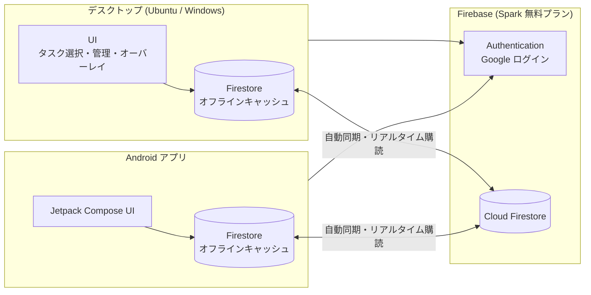

# 30min-task-timer v2 要件定義書

- ステータス: 確定 v0.4
- 更新日: 2026-10-06
- 対象: 現行アプリ（リポジトリ直下の `main.pyw` / `app/`）の作り替え

## 変更履歴

| 版 | 日付 | 内容 |
|----|------|------|
| v0.1 | 2026-10-06 | 初版（Supabase + PWA 案） |
| v0.4 | 2026-10-06 | UI フレームワークを React に決定（Q-09）。P2 完了。§10 に v1 の不具合を追記 |
| v0.3 | 2026-10-06 | デスクトップを Electron ＋ TypeScript に決定。優先度の選択肢を固定（§5.5）。退勤スケジュールは Android に表示しないことに決定。P0 完了 |
| v0.2 | 2026-10-06 | DB を Firebase（Cloud Firestore）に変更。モバイルを Android ネイティブアプリに変更（ストア公開なし）。Google ログインに決定。デスクトップはオンラインで動かしつつ、オフラインでも使える方針に決定。デスクトップの技術見直し（§6.3）を追加 |

---

## 1. 背景と目的

### 1.1 背景

現行アプリは Tkinter 製のデスクトップアプリで、30分ごとに「今から何をやる？」と作業タスクの選択を促し、タスクごとの作業時間を記録する。
タスクデータはローカルの JSON ファイル（`%APPDATA%` / `~/.30min-task-timer` 配下の `tasks.json`）に保存しているため、**PC の前にいないとタスクを追加・確認・整理できない**。

また、元々 Windows で使っていたが現在は Ubuntu で使っており、**画面レイアウトの崩れが起きている**（原因の分析は §6.3.1）。

### 1.2 目的

1. タスクデータとタスクの状況（実行中セッションなど）を **Firebase（Cloud Firestore）** に保存する。
2. **Android アプリからタスクの追加・編集・完了・削除・閲覧** と、PC で今何をしているかの確認をできるようにする。
3. メインの利用環境は引き続き **デスクトップ（Ubuntu が主、Windows も対応）** とし、現行の基本機能はすべて維持する。
4. デスクトップは普段オンラインで動かすが、**オフラインでも普段どおり使え、復帰時に自動で同期される** ようにする。
5. Ubuntu での UI 崩れを解消する。

### 1.3 スコープ外（v2 では行わない）

- Android 側での「30分タイマー」「退勤スケジュール」の通知・強制停止（デスクトップのみ）
- Google Play への公開（APK を手元の端末にインストールする運用）
- iOS アプリ
- 複数ユーザーでのタスク共有・チーム機能
- README の画面遷移図にある「改修要望管理画面」系（coming soon のまま。別途検討）

---

## 2. 現行機能の棚卸し（v2 でも維持する機能）

| # | 機能 | 現行の実装箇所 | v2 での扱い |
|---|------|----------------|-------------|
| F-01 | 30分ごとにタスク選択画面を表示 | `TaskPickerController.on_start_session` / `TIME_MS_INTERVAL` | 維持 |
| F-02 | 「5分後に再通知」（スヌーズ） | `TaskPickerController.on_snooze` / `TIME_MS_SNOOZE` | 維持 |
| F-03 | タスク選択画面からのクイック追加（優先度 `NOW`） | `TaskPickerController.on_add_task` | 維持 |
| F-04 | 前回選択タスクの表示（「前回の続き」） | `Task.last_selected` | 維持（ユーザー単位で保存） |
| F-05 | セッション中のフローティングオーバーレイ（ホバーで展開、クリックで完了） | `SessionInterruptOverlay` | 維持 |
| F-06 | セッション時間の記録（累計分数・セッション回数） | `SessionService` → `TaskService.record_session` | 維持（記録方式は §5 で変更） |
| F-07 | タスク管理画面：新規登録・更新・完了・削除（論理削除） | `TaskManagementController` | 維持 |
| F-08 | タスク属性：名前・メモ・優先度・完了・累計時間・作成日 | `app/models/task.py` | 維持＋拡張（§5） |
| F-09 | 退勤スケジュール（退勤時刻と何分前に止めるか → 5分前警告・強制停止） | `LeaveScheduleService` / `LeaveScheduleView` | 維持 |
| F-10 | システムトレイ常駐 | `TrayManager`（pystray） | 維持 |
| F-11 | 多重起動防止（2つ目の起動時に置き換え/前面表示） | `main.pyw`（ロックファイル＋ループバック IPC） | 維持 |
| F-12 | マルチモニタで同じモニタにウィンドウを出す | `window_geometry.center_window` | 維持 |
| F-13 | テストモード（間隔短縮・別データ） | `TASK_MODE=test` | 維持（Firestore は Emulator または別コレクションで分離） |
| F-14 | 破壊的操作の確認ダイアログ | 各 Controller の `messagebox.askokcancel` | 維持 |

---

## 3. 新規要件（機能要件）

### 3.1 認証

| ID | 要件 | 優先度 |
|----|------|--------|
| A-01 | デスクトップ・Android とも **Google アカウントでログイン** する（Firebase Authentication の Google プロバイダ） | Must |
| A-02 | ログインは初回のみ。以降はログイン状態を保持し、オフライン起動時もログイン済みとして動作する | Must |
| A-03 | デスクトップのログインは「システムのブラウザを開いて Google でログイン → アプリに戻る」方式（§6.3.3） | Must |
| A-04 | ログアウト操作（デスクトップはトレイメニュー、Android は設定画面） | Should |

### 3.2 デスクトップ：クラウド連携

| ID | 要件 | 優先度 |
|----|------|--------|
| D-01 | タスクの追加・編集・完了・削除を Firestore に保存する | Must |
| D-02 | **タスクの状況を書き込む**：セッション開始時に「実行中タスク・開始時刻・予定終了時刻」を、完了・中断時に結果を書き込む。スヌーズ中・退勤ブロック中などの状態も書き込む | Must |
| D-03 | 作業セッションの記録（開始・終了・経過分数）を Firestore に保存する | Must |
| D-04 | **オフラインでも全機能が使える**。書き込みは端末内に保存され、オンライン復帰時に自動送信される。アプリを再起動しても未送信データは失われない | Must |
| D-05 | Android での変更を、開いている画面に数秒以内で反映する（リアルタイム購読） | Must |
| D-06 | 同期状態（同期済み / 未送信あり / オフライン）を画面またはトレイに表示する | Should |
| D-07 | 初回ログイン時に既存の `tasks.json` を Firestore へ移行する（1回だけ、重複しない） | Must |

### 3.3 Android アプリ

| ID | 要件 | 優先度 |
|----|------|--------|
| M-01 | Google アカウントでログイン（A-01） | Must |
| M-02 | 未完了タスク一覧の表示（優先度・作成日順、累計時間表示） | Must |
| M-03 | タスクの追加（名前・優先度・メモ） | Must |
| M-04 | タスクの編集・完了・削除（論理削除、確認ダイアログあり） | Must |
| M-05 | **PC の現在の状況** を表示（実行中タスク名・開始時刻・経過時間 / スヌーズ中 / 停止中 / PC オフライン） | Must |
| M-06 | 完了済みタスクの表示と「未完了に戻す」 | Should |
| M-07 | オフラインでも閲覧・編集でき、オンライン復帰時に自動同期（Firestore のオフライン機能） | Should |
| M-08 | 「次に PC でやるタスク」を予約（次回のタスク選択画面で初期選択される） | Could |
| M-09 | 日別・タスク別の作業時間の集計 | Could |
| M-10 | ホーム画面ウィジェット（PC の現在の状況） | Could |

---

## 4. 非機能要件

| ID | 区分 | 要件 |
|----|------|------|
| N-01 | コスト | 個人利用の範囲で **月額 0 円**。Firebase は無料の Spark プランで運用し、課金アカウントを登録しない（上限を超えても請求は発生しない） |
| N-02 | セキュリティ | Firestore セキュリティルールで「自分の `users/{uid}` 配下のみ読み書き可」とする。サービスアカウントキー（管理者権限）はクライアントに置かない |
| N-03 | セキュリティ | 通信はすべて HTTPS。デスクトップの認証トークンは OS のキーストア（Ubuntu: GNOME Keyring / Windows: 資格情報マネージャー）または Firebase SDK の標準保存領域に保存する |
| N-04 | 可用性 | ネットワーク断・Firebase 障害でもデスクトップのタイマー機能は止まらない（D-04） |
| N-05 | データ整合性 | PC と Android で同時に操作しても、セッション時間が消えたり二重計上されたりしない（§5.3） |
| N-06 | 性能 | タスク選択画面は 1 秒以内に表示（端末内キャッシュから即描画） |
| N-07 | 対応環境 | デスクトップ: **Ubuntu（主）**、Windows 10/11。Android: 10 以上（目安） |
| N-08 | 見た目の一貫性 | Ubuntu と Windows で同じレイアウト・フォント・サイズで表示される。高 DPI ディスプレイで崩れない。画面サイズに合わせて伸縮し、固定ピクセルのウィンドウサイズに依存しない |
| N-09 | タイムゾーン | 保存は UTC。表示タイムゾーンは端末の設定に従う（現行は `America/Vancouver` がハードコード） |
| N-10 | 保守性 | 画面・状態管理・データアクセスを分けた構成にし、Firestore へのアクセスはリポジトリ層に閉じ込める |
| N-11 | テスト | ドメインロジック（タイマー、退勤スケジュール、セッション集計）に自動テストを書く。Firestore のルールは Firebase Emulator でテストする |

---

## 5. データ設計（Cloud Firestore）

### 5.1 コレクション構成

```
users/{uid}
  ├─ tasks/{taskId}          タスク
  ├─ sessions/{sessionId}    作業セッション（追記専用）
  └─ state/desktop           PC の現在の状況（1 ドキュメント）
  └─ state/preferences       ユーザー設定・前回選択タスクなど（1 ドキュメント）
```

**tasks/{taskId}**（現行 `Task` を拡張）

| フィールド | 型 | 説明 |
|-----------|----|------|
| name | string | タスク名（必須） |
| memo | string | メモ |
| priority | string | 優先度（`NOW` / `SOONER` / `ANYTIME` / `SOMEDAY` のいずれか。§5.5） |
| completed | boolean | 完了フラグ |
| completedAt | timestamp \| null | 完了日時（新規） |
| deleted | boolean | 論理削除フラグ |
| totalMinutes | number | 累計作業分数（`increment()` でのみ更新） |
| sessionCount | number | セッション回数（`increment()` でのみ更新） |
| createdAt | timestamp | 作成日時 |
| updatedAt | timestamp | 最終更新日時（サーバー時刻） |
| updatedBy | string | 更新元（`desktop` / `android`） |

- `taskId` は現行の `Task.id`（UUID）をそのまま使う（移行時の重複防止）。

**sessions/{sessionId}**（新規・追記専用）

| フィールド | 型 | 説明 |
|-----------|----|------|
| taskId | string | 対象タスク |
| taskName | string | 記録時点のタスク名（集計表示用） |
| startedAt | timestamp | 開始日時 |
| endedAt | timestamp | 終了日時 |
| elapsedMinutes | number | 経過分数 |
| endReason | string | `completed` / `interval` / `leave_stop` / `app_exit` |
| device | string | 記録した端末名 |

**state/desktop**（新規・PC の現在の状況、D-02 / M-05）

| フィールド | 型 | 説明 |
|-----------|----|------|
| status | string | `idle`（選択画面表示中）/ `running`（セッション中）/ `snoozed` / `leave_blocked`（退勤のため停止中。Android では「停止中」と表示）/ `stopped`（アプリ終了） |
| currentTaskId | string \| null | 実行中タスク |
| currentTaskName | string \| null | 実行中タスク名 |
| startedAt | timestamp \| null | セッション開始時刻 |
| nextPromptAt | timestamp \| null | 次にタスク選択画面が出る予定時刻 |
| heartbeatAt | timestamp | 最終生存確認時刻（数分おきに更新。古ければ Android 側で「PC オフライン」と表示） |
| device | string | 端末名 |

**state/preferences**

| フィールド | 型 | 説明 |
|-----------|----|------|
| lastSelectedTaskId | string \| null | 「前回の続き」（現行の `last_selected` フラグを置き換え） |
| nextTaskId | string \| null | Android から予約した次タスク（M-08） |

### 5.2 集計値の扱い

- `totalMinutes` / `sessionCount` は、セッション終了時に **sessions の追加と tasks の `increment()` を 1 回のバッチ書き込み** で行う。
- `increment()` は同時に・オフラインで書き込んでも加算が失われない（上書きではなく加算として合成される）ため、PC と Android の操作が競合しない（N-05）。
- sessions が正（記録の元データ）なので、万一ずれても sessions から再計算できる。
- 既存 `tasks.json` の `total_minutes` / `completed_sessions` は、移行時にそのまま `totalMinutes` / `sessionCount` に入れる。

### 5.3 同期・競合解決ルール

1. デスクトップ・Android とも **Firestore SDK のオフライン永続化（端末内キャッシュ）** を有効にする。書き込みは即座に端末内に反映され、オンライン時に自動送信される。独自の送信キューは作らない。
2. タスクの更新は変更したフィールドだけを送る（`update()`）。同じフィールドを同時に変更した場合は後から届いたほうが勝つ。
3. 数値の加算は必ず `increment()` を使い、読み込んだ値に足して書き戻す実装はしない。
4. sessions は追記専用で競合しない。`sessionId` はクライアントで生成し、再送しても重複しない。
5. 削除は論理削除のみ。完了・削除は「戻す」操作で復元できる。

### 5.4 セキュリティルール（方針）

```
match /users/{uid}/{document=**} {
  allow read, write: if request.auth != null && request.auth.uid == uid;
}
```

- 実装時にフィールドの型・必須チェックを追加する。ルールはリポジトリで管理し、Emulator でテストする。

### 5.5 優先度（固定）

優先度は次の 4 つに固定する。値は Firestore に英字のまま保存し、セキュリティルールでもこの 4 つ以外を拒否する。

| 値 | 表示 | 意味 | 並び順 | 色（現行踏襲） |
|----|------|------|--------|---------------|
| `NOW` | 🔥 NOW | 今すぐやる | 1 | `#fee2e2` |
| `SOONER` | ⭐ SOONER | 近いうちにやる | 2 | `#fef3c7` |
| `ANYTIME` | 📝 ANYTIME | いつでもよい | 3 | `#dcfce7` |
| `SOMEDAY` | 💤 SOMEDAY | いつか | 4 | `#f3f4f6` |

- 新規作成時の初期値は `NOW`（タスク選択画面のクイック追加・タスク管理画面とも現行どおり）。
- 一覧は「優先度の並び順 → 作成日時の古い順」で表示する。
- 移行時、`tasks.json` の priority が上記 4 つ以外（`なし`、空文字など）の場合は `SOMEDAY` にする。

### 5.6 無料枠（Spark プラン）の目安

Firestore の無料枠はおおむね「保存 1 GiB、読み取り 5 万回/日、書き込み 2 万回/日」。
本アプリの想定（タスク数百件、1 日 20〜30 セッション、heartbeat 5 分間隔）なら、書き込みは 1 日数百回程度で、十分に収まる。
Supabase の無料プランと違い、使わない期間があってもプロジェクトが一時停止されない。
※ 料金や上限は変わることがあるため、着手前に公式の料金ページで確認する。

---

## 6. システム構成

### 6.1 全体構成



### 6.2 データベース：Firebase は適しているか

**結論：適している。v0.1 の Supabase 案から Firebase に変更する。**

Android をネイティブアプリにすることで、Firebase のほうが有利になった。

| 観点 | Firebase（Firestore） | Supabase（v0.1 案） |
|------|----------------------|---------------------|
| Android | 公式 SDK が最も充実。オフライン対応が標準で有効 | 公式の Kotlin SDK はあるが、オフライン同期は自前実装 |
| Google ログイン | Android 標準の Credential Manager と組み合わせるだけ | 可能だが設定がやや多い |
| デスクトップのオフライン対応 | 公式の JavaScript SDK を使えば標準機能で対応できる（§6.3） | 自前で SQLite と送信キューを作る必要がある |
| 無料プランの注意点 | 一時停止なし | 1 週間使わないと一時停止 |
| 集計 | 苦手（`increment()` と事前集計で対応、§5.2） | SQL のビューで集計できる |
| Python から使う場合 | ユーザーとして使える公式 SDK がなく、REST を自前で叩き、オフライン対応も自前 | 公式 SDK あり |

**注意点**: Firebase の公式 SDK は **Python 向けに「ユーザーとしてログインして使う」ものがない**（Python 向けは管理者権限のサーバー用 SDK のみ）。デスクトップを Python のまま作ると、オフライン対応・リアルタイム購読・トークン更新を自前で作ることになり、Firebase の良さが活かせない。これがデスクトップの技術を見直す（§6.3）大きな理由の一つ。

### 6.3 デスクトップの技術見直し

#### 6.3.1 Ubuntu で UI が崩れる原因（現行コードから推測）

1. **ウィンドウサイズが固定ピクセル**：`WINDOW_WIDTH = 1200` / `WINDOW_HEIGHT = 1400`（`app/config/constants.py`）。高さ 1400px は一般的な 1080px の画面に収まらない。
2. **フォントが OS ごとに違う**：Windows は Meiryo、Ubuntu は Noto Sans CJK JP。文字の幅・高さが違うため、文字数基準の `width=` や固定サイズの配置がずれる。
3. **Tk の高 DPI 対応が弱い**：Linux の Tk は画面の拡大率を自動で反映しないため、拡大率 125%/150% の環境では文字だけ大きくなったり、逆に小さすぎたりする。
4. **Wayland の制約**：Ubuntu の標準は Wayland で、Wayland ではアプリが自分でウィンドウ位置を決めたり、常に最前面にしたりすることが制限される（現行の Tk は XWayland 経由で動いているため、ある程度は効いている）。
5. **トレイアイコン**：GNOME は標準でトレイ非対応で、拡張機能が必要（技術を変えても同じ）。

1〜3 は Tk を使う限り根本的には直しにくい。4・5 はどの技術でも残る（§6.3.4）。

#### 6.3.2 候補の比較

| 候補 | 言語 | Firebase 連携 | Ubuntu での見た目 | 常駐系の機能（トレイ・最前面・多重起動防止） | 評価 |
|------|------|--------------|------------------|------------------------------|------|
| **A. Electron**（採用） | TypeScript | **公式 JS SDK がそのまま動く**（オフライン永続化・リアルタイム購読・トークン自動更新が標準） | Chromium を同梱するので **Windows と完全に同じ表示**。CSS で伸縮するレイアウト、高 DPI 対応 | トレイ・最前面・透明ウィンドウ・多重起動防止（`requestSingleInstanceLock`）が標準 API である | ◎ |
| B. Tauri v2 | TypeScript ＋ 少量の Rust | 公式 JS SDK が動く | Linux では WebKitGTK で描画するため、Windows（WebView2）と細部の見た目・挙動が異なることがある | プラグインで対応 | ○ 軽量（数 MB）だが Linux での安定性で A に劣る |
| C. Python ＋ PySide6（Qt） | Python | REST を自前実装。オフライン対応・リアルタイム購読も自前 | Tk より大幅に改善（高 DPI 対応、フォント描画が良い） | `QSystemTrayIcon`、`QLocalServer` で対応 | ○ Python を続けたい場合の選択肢。Firebase 部分の実装が重い |
| D. Flutter（Android と共通化） | Dart | **公式の FlutterFire が Linux 非対応** | 良好 | パッケージで対応 | △ Ubuntu がメインなので不適 |
| E. 現行 Tkinter を改修 | Python | C と同じく自前実装 | 根本解決が難しい | 現状のまま | △ |

#### 6.3.3 採用案：Electron ＋ TypeScript

**理由**
- Firebase の公式 SDK がそのまま使え、**「オフラインでも使える」「Android の変更がすぐ届く」が SDK の標準機能で実現できる**。自前の同期処理が不要になり、作る量とバグの元が大きく減る。
- Chromium を同梱するため、**Ubuntu と Windows で見た目が一致** し、UI 崩れの根本原因（Tk・フォント・DPI）がなくなる。
- 小さな常駐オーバーレイ、トレイ、多重起動防止など、現行の機能がすべて標準 API で作れる。現行の「ロックファイル＋TCP サーバー」の仕組みや、pystray のスレッドで終了が止まる問題（CLAUDE.md 参照）もなくなる。

**デメリット**
- アプリのサイズが大きい（100 MB 前後）、メモリ使用量が Tk より多い（150〜250 MB 程度）。個人利用なら問題ないと判断。
- Python から TypeScript への言語変更になる。

**主な構成**
- UI: React ＋ CSS（レイアウトは画面サイズに合わせて伸縮）
- ウィンドウ: タスク選択 / タスク管理 / 退勤スケジュールの各ウィンドウ ＋ 常に最前面の小さなオーバーレイ
- タイマー: メインプロセスで管理（現行 `TimerService` の役割）
- Firebase: Web SDK（`persistentLocalCache` でオフライン永続化）
- Google ログイン: Electron 内のポップアップログインは Google にブロックされるため、**システムのブラウザでログイン → ローカルの一時ポート（ループバック）で結果を受け取る → `signInWithCredential` で Firebase にログイン** する方式にする
- パッケージ: electron-builder で Ubuntu 向け（AppImage / .deb）と Windows 向け（.exe）を作る

**Python を続けたい場合** は C（PySide6）を採用する。その場合は v0.1 の設計（SQLite のキャッシュ＋送信キュー＋Firestore REST）が必要になる。

#### 6.3.4 どの技術でも残る Ubuntu 固有の注意点

- **Wayland**：オーバーレイを「常に最前面」「画面の決まった位置」に出すには、Wayland では制限がある。Electron は X11 互換モード（XWayland）で起動する設定（`--ozone-platform=x11`）にして、現行と同じ動きにする。
- **トレイアイコン**：GNOME 拡張機能「AppIndicator and KStatusNotifierItem Support」が必要（現行と同じ）。

### 6.4 Android アプリの構成

| 項目 | 内容 |
|------|------|
| 言語・UI | Kotlin ＋ Jetpack Compose |
| Firebase | Firebase Android SDK（Auth / Firestore、オフライン永続化は標準で有効） |
| ログイン | Credential Manager（Google でログイン）→ Firebase Authentication |
| 配布 | Android Studio から署名付き APK を作り、自分の端末に直接インストール（Firebase App Distribution も無料で使える） |
| 必要な設定 | Firebase コンソールに Android アプリを登録し、署名証明書の SHA-1 を登録（Google ログインに必須） |

### 6.5 リポジトリ構成（案）

```
v2/
├─ docs/          要件定義書・設計書
├─ desktop/       デスクトップアプリ（Electron + TypeScript）
├─ android/       Android アプリ（Kotlin）
└─ firebase/      セキュリティルール・インデックス・Emulator 設定
```

現行アプリ（`main.pyw` / `app/`）は v2 が完成するまでそのまま残し、日常利用を続ける。

---

## 7. 画面要件

### 7.1 デスクトップ（現行から差分のみ）

| 画面 | 変更内容 |
|------|---------|
| 初回セットアップ画面（新規） | 「Google でログイン」ボタン。既存 `tasks.json` があれば移行確認 |
| タスク選択画面 | 同期状態の小さな表示。Android から予約された次タスクを初期選択（M-08） |
| タスク管理画面 | 同期状態表示、完了済みの表示切替と「未完了に戻す」 |
| トレイメニュー | 「ログアウト」を追加 |
| 全画面 | 画面サイズ・拡大率に合わせて伸縮するレイアウトに変更 |

### 7.2 Android（新規）

1. ログイン画面（Google でログイン）
2. ホーム：PC の現在の状況カード（M-05）＋ 未完了タスク一覧
3. タスク追加・編集画面（名前・優先度・メモ）
4. 完了済みタスク一覧（M-06）
5. （Could）作業時間の集計画面

---

## 8. 決定事項と未決事項

### 8.1 決定事項

| # | 内容 | 決定 |
|---|------|------|
| Q-01 | データベース | Firebase（Cloud Firestore） |
| Q-02 | モバイル | Android ネイティブアプリ。ストア公開はしない |
| Q-03 | ログイン方式 | Google ログイン |
| Q-05 | 新しいコードの置き場所 | `v2/` 配下で並行開発し、完成後に置き換え |
| — | デスクトップのネットワーク | 普段はオンラインで動かし、タスクの状況を書き込む。オフラインでも使える |
| Q-04 | 優先度の選択肢 | `NOW` / `SOONER` / `ANYTIME` / `SOMEDAY` に固定（§5.5） |
| Q-06 | 退勤スケジュールの Android 表示 | 表示しない（設定・確認ともデスクトップのみ） |
| Q-08 | デスクトップの技術 | Electron ＋ TypeScript |
| Q-09 | デスクトップの UI フレームワーク | React |

### 8.2 未決事項（仮決めのまま進め、必要になったら見直す）

| # | 内容 | 現時点の仮決め |
|---|------|---------------|
| Q-07 | 複数台の PC で同時に使う想定があるか | 1 台のみ想定 |
| Q-10 | Android からの操作を PC に通知するか（例：「スマホでタスクが追加されました」） | 通知しない（次にタスク選択画面を開いたときに反映） |

---

## 9. 開発ステップ（案）

| フェーズ | 内容 | 完了条件 |
|---------|------|---------|
| P0 | 要件定義（本書）の確定 | 完了（v0.3） |
| P1 | Firebase プロジェクト作成、Google ログイン有効化、セキュリティルールと Emulator 環境を `v2/firebase/` に用意 | ルールのテストが Emulator で通る（ルール・テストは作成済み。プロジェクト作成は `v2/firebase/README.md` の手順で手作業） |
| P2 | デスクトップ：ローカル動作のみで現行機能を作り直す（タイマー、選択・管理画面、オーバーレイ、退勤スケジュール、トレイ、多重起動防止） | 完了（`v2/desktop/`）。ユニットテスト・E2E テストで確認済み |
| P3 | デスクトップ：Google ログイン、Firestore 連携、`state/desktop` の書き込み、`tasks.json` 移行 | オフラインで操作 → 復帰後に Firestore と一致する |
| P4 | Android：ログイン、タスク一覧・追加・編集・完了・削除、PC の状況表示 | Android で追加したタスクが PC のタスク選択画面にすぐ出る |
| P5 | Should / Could 項目（完了済み表示、次タスク予約、集計、ウィジェットなど） | — |

---

## 10. 現行コードで把握している課題（作り替え時に解消する）

- `AppController.exit_app()` と `_shutdown()` の両方で `record_session(session_service.finish())` を呼んでおり、`SessionService.finish()` が状態をリセットしないため、**終了時にセッション時間が二重計上される可能性がある**。v2 ではセッションの終了処理を一度きりにする。
- 退勤時刻の入力が日付またぎに未対応（`TaskPickerController.on_start_session` の `#fix` コメント）。
- 表示タイムゾーンが `America/Vancouver` に固定（`app/models/task.py`）。
- ウィンドウサイズが固定ピクセル（1200×1400）で、画面に収まらない場合がある（§6.3.1）。
- 優先度の既定値が不統一（`Task` の既定値は `なし`、読み込み時は空文字）。v2 では §5.5 の 4 つに固定する。
- 30分タイマーが取り消せない（`TimerService.schedule`）。セッションをオーバーレイで途中完了して次のセッションを始めると、前のセッションの30分タイマーが残っていて、早すぎるタイミングでタスク選択画面が開き、時間も記録される。v2 では取り消し可能なタイマーにした。
- タスク管理画面のメモ欄に入力しても保存されない（`add_task` / `edit_task` がメモを受け取らない）。また、タスクを選択してもメモ欄に反映されない。
- タスク選択画面をウィンドウの × で閉じると、スヌーズも予約されず、トレイから操作するまで二度と表示されない。v2 では × で閉じるとスヌーズ扱いにした。
- 作業終了（ブロック）画面はトレイからしか終了できないため、トレイが表示されない環境（GNOME で拡張機能なし）では終了手段がない。v2 では画面に「アプリを終了」ボタンを置いた。
- 自動テスト・lint が未整備。
