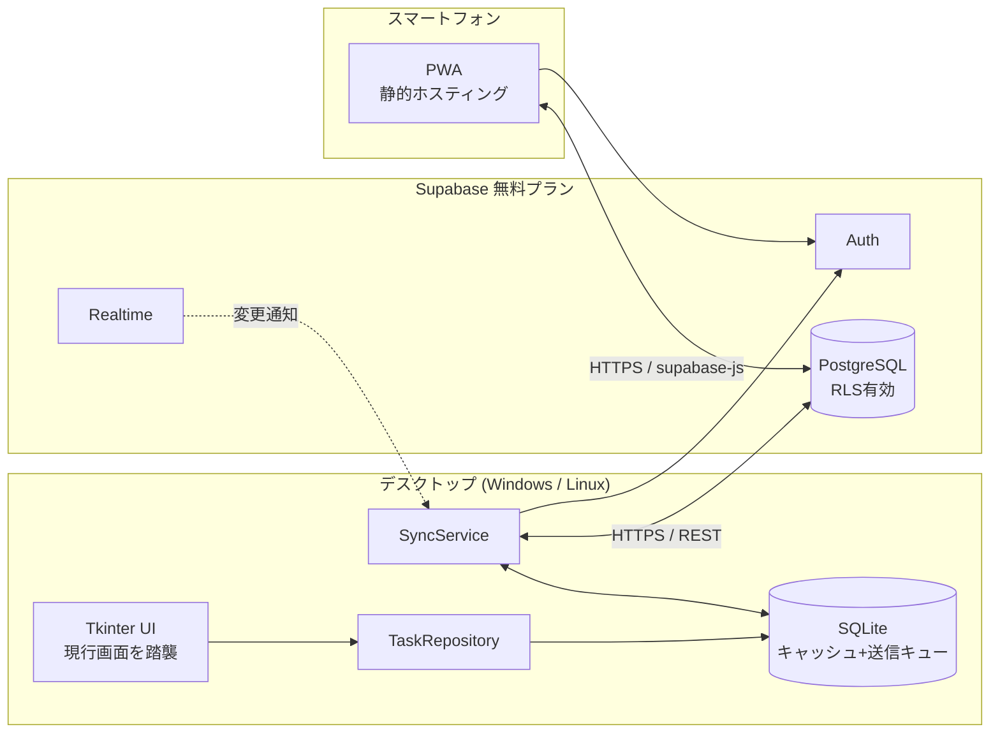

# 30min-task-timer v2 要件定義書

- ステータス: ドラフト v0.1
- 作成日: 2026-10-06
- 対象: 現行アプリ（リポジトリ直下の `main.pyw` / `app/`）の作り替え

---

## 1. 背景と目的

### 1.1 背景

現行アプリは Tkinter 製のデスクトップアプリで、30分ごとに「今から何をやる？」と作業タスクの選択を促し、タスクごとの作業時間を記録する。
タスクデータはローカルの JSON ファイル（`%APPDATA%` / `~/.30min-task-timer` 配下の `tasks.json`）に保存しているため、**PC の前にいないとタスクを追加・確認・整理できない**。

### 1.2 目的

1. タスクデータを **無料で使えるクラウドデータベース** に保存する。
2. **スマートフォンからタスクの追加・編集・完了・削除・閲覧** ができるようにする。
3. メインの利用環境は引き続き **デスクトップ（Windows / Linux）** とし、現行の基本機能はすべて維持する。

### 1.3 スコープ外（v2 では行わない）

- スマホ側での「30分タイマー」「退勤スケジュール」機能（通知・強制停止はデスクトップのみ）
- 複数ユーザーでのタスク共有・チーム機能
- ネイティブモバイルアプリ（App Store / Google Play への公開）
- README の画面遷移図にある「改修要望管理画面」系（coming soon のまま。別途検討）

---

## 2. 現行機能の棚卸し（v2 でも維持する機能）

| # | 機能 | 現行の実装箇所 | v2 での扱い |
|---|------|----------------|-------------|
| F-01 | 30分ごとにタスク選択画面を表示 | `TaskPickerController.on_start_session` / `TIME_MS_INTERVAL` | 維持 |
| F-02 | 「5分後に再通知」（スヌーズ） | `TaskPickerController.on_snooze` / `TIME_MS_SNOOZE` | 維持 |
| F-03 | タスク選択画面からのクイック追加（優先度 `NOW`） | `TaskPickerController.on_add_task` | 維持 |
| F-04 | 前回選択タスクの表示（「前回の続き」） | `Task.last_selected` | 維持（端末ごとではなくユーザー単位） |
| F-05 | セッション中のフローティングオーバーレイ（ホバーで展開、クリックで完了） | `SessionInterruptOverlay` | 維持 |
| F-06 | セッション時間の記録（累計分数・セッション回数） | `SessionService` → `TaskService.record_session` | 維持（記録方式は §5 で変更） |
| F-07 | タスク管理画面：新規登録・更新・完了・削除（論理削除） | `TaskManagementController` | 維持 |
| F-08 | タスク属性：名前・メモ・優先度・完了・累計時間・作成日 | `app/models/task.py` | 維持＋拡張（§5） |
| F-09 | 退勤スケジュール（退勤時刻と何分前に止めるか → 5分前警告・強制停止） | `LeaveScheduleService` / `LeaveScheduleView` | 維持 |
| F-10 | システムトレイ常駐（pystray） | `TrayManager` | 維持 |
| F-11 | 多重起動防止（ロックファイル＋ループバック IPC、置き換え/フォーカス） | `main.pyw` | 維持 |
| F-12 | マルチモニタ対応のウィンドウ中央寄せ | `window_geometry.center_window` | 維持 |
| F-13 | テストモード（`TASK_MODE=test` で間隔短縮・別データ） | `app/config/constants.py`, `paths.py` | 維持（クラウド側もテスト用データを分離） |
| F-14 | 破壊的操作の確認ダイアログ | 各 Controller の `messagebox.askokcancel` | 維持 |

---

## 3. 新規要件（機能要件）

### 3.1 クラウドデータベース連携（デスクトップ）

| ID | 要件 | 優先度 |
|----|------|--------|
| C-01 | タスク・セッション記録をクラウド DB に保存する | Must |
| C-02 | **オフラインでもデスクトップアプリは従来どおり動作する**（ローカルキャッシュに書き込み、復帰後に同期） | Must |
| C-03 | タスク選択画面・タスク管理画面を開くタイミングでクラウドから最新を取得する | Must |
| C-04 | スマホでの変更をリアルタイム（数秒以内）で開いている画面に反映する | Should |
| C-05 | 同期状態（同期済み / 未同期件数 / オフライン）を画面またはトレイに表示する | Should |
| C-06 | 初回起動時に既存の `tasks.json` をクラウドへ移行する（1回だけ、重複しない） | Must |
| C-07 | ログイン（初回のみ）とログイン状態の保持。認証情報は OS のキーストアに保存する | Must |
| C-08 | クラウドを使わない「ローカルのみモード」を設定で選べる | Could |

### 3.2 モバイルからの操作

| ID | 要件 | 優先度 |
|----|------|--------|
| M-01 | スマホのブラウザから利用できる Web アプリ（PWA）を提供する。ホーム画面に追加可能 | Must |
| M-02 | 未完了タスク一覧の表示（優先度・作成日順、累計時間表示） | Must |
| M-03 | タスクの追加（名前・優先度・メモ） | Must |
| M-04 | タスクの編集・完了・削除（論理削除、確認ダイアログあり） | Must |
| M-05 | 完了済みタスクの表示と「未完了に戻す」 | Should |
| M-06 | デスクトップで現在実行中のセッション（タスク名・開始時刻・経過時間）を表示 | Should |
| M-07 | 日別・タスク別の作業時間の簡易集計 | Could |
| M-08 | スマホから「次に PC でやるタスク」を予約（次回のタスク選択画面で初期選択される） | Could |
| M-09 | オフライン時は閲覧のみ可能（キャッシュ表示） | Could |

---

## 4. 非機能要件

| ID | 区分 | 要件 |
|----|------|------|
| N-01 | コスト | 個人利用の範囲で **月額 0 円** で運用できること（DB・ホスティングとも無料枠内） |
| N-02 | セキュリティ | 本人のデータは本人しか読み書きできない（DB の行レベルセキュリティで担保）。管理者キー（service role key 等）をクライアントに埋め込まない |
| N-03 | セキュリティ | 通信はすべて HTTPS。デスクトップのトークンは `keyring` で OS キーストアに保存し、平文ファイルに置かない |
| N-04 | 可用性 | クラウド障害・ネットワーク断でもデスクトップのタイマー機能は止まらない（C-02） |
| N-05 | データ整合性 | デスクトップとスマホで同時に編集しても、セッション時間が消えたり二重計上されたりしない（§5.3） |
| N-06 | 性能 | タスク選択画面は 1 秒以内に表示（まずローカルキャッシュで描画し、裏で同期） |
| N-07 | 対応環境 | デスクトップ: Windows 10/11, Ubuntu（現行と同じ）。モバイル: iOS Safari / Android Chrome の最新版 |
| N-08 | タイムゾーン | 保存は UTC。表示タイムゾーンは設定可能にする（現行は `America/Vancouver` がハードコード） |
| N-09 | 保守性 | 現行のレイヤ構成（Controller / View / Service / Infrastructure）を踏襲し、永続化層をリポジトリインターフェースで差し替え可能にする |
| N-10 | テスト | ドメイン層・同期ロジックに pytest による自動テストを導入する（現行はテストなし） |

---

## 5. データ設計

### 5.1 エンティティ

**tasks**（現行 `Task` を拡張）

| カラム | 型 | 説明 |
|--------|----|------|
| id | uuid (PK) | 現行の `Task.id` をそのまま引き継ぐ |
| user_id | uuid | 所有者（認証ユーザー） |
| name | text | タスク名（必須） |
| memo | text | メモ |
| priority | text | 優先度（`NOW` / 現行の値を踏襲。選択肢は §8 で確定） |
| completed | boolean | 完了フラグ |
| completed_at | timestamptz | 完了日時（新規） |
| deleted | boolean | 論理削除フラグ |
| created_at | timestamptz | 作成日時 |
| updated_at | timestamptz | 最終更新日時（同期・競合解決用、新規） |
| updated_by | text | 更新元（`desktop` / `mobile`、新規） |

**work_sessions**（新規・追記専用）

| カラム | 型 | 説明 |
|--------|----|------|
| id | uuid (PK) | クライアント側で採番（オフライン追記のため） |
| user_id | uuid | 所有者 |
| task_id | uuid (FK) | 対象タスク |
| started_at | timestamptz | 開始日時 |
| ended_at | timestamptz | 終了日時（実行中は NULL） |
| elapsed_minutes | integer | 経過分数（終了時に確定） |
| device | text | 記録した端末名 |

**user_state**（新規・ユーザーごと 1 行）

| カラム | 型 | 説明 |
|--------|----|------|
| user_id | uuid (PK) | 所有者 |
| last_selected_task_id | uuid | 「前回の続き」（現行の `last_selected` フラグを置き換え） |
| next_task_id | uuid | スマホから予約した次タスク（M-08） |
| updated_at | timestamptz | 更新日時 |

### 5.2 集計値の扱い

- 現行の `total_minutes` / `completed_sessions` は **work_sessions から集計するビュー**（`task_stats`）で提供する。
- これによりデスクトップの加算とスマホの編集が同じ行を奪い合わず、二重計上・取りこぼしが起きない（N-05）。
- 既存 `tasks.json` の `total_minutes` / `completed_sessions` は、移行時に「移行分」として 1 件の work_session（`device = 'migration'`）にまとめて登録する。

### 5.3 同期・競合解決ルール

1. デスクトップはローカル SQLite をキャッシュ兼送信キューとして持つ。すべての書き込みはまずローカルに確定し、送信キューに積む。
2. オンライン時にキューを順に送信する。送信は `id` 指定の upsert とし、再送しても重複しない（冪等）。
3. tasks の競合は **`updated_at` による後勝ち（Last-Write-Wins）**。項目単位のマージは行わない。
4. work_sessions は追記専用なので競合しない。
5. 削除は論理削除のみ（物理削除しない）。完了・削除は「戻す」操作で復元可能とする。

---

## 6. システム構成（推奨案）

### 6.1 データベースの選定

| 候補 | 無料枠の概要 | Python（デスクトップ） | モバイル Web | 評価 |
|------|-------------|----------------------|-------------|------|
| **Supabase**（推奨） | PostgreSQL 500MB、Auth・Realtime 込み | 公式 `supabase-py` あり | `supabase-js` で静的 PWA から直接利用可 | ◎ リレーショナル（集計ビューが書ける）、RLS で安全に直接アクセス可能 |
| Firebase Firestore | Spark プラン（1GiB、読込 5万/日 等） | 公式はサーバー向け Admin SDK のみ。エンドユーザー認証は REST を自前実装 | Web SDK が強力・オフライン対応 | ○ モバイルは楽だがデスクトップ側の実装負担が大きい |
| Google Sheets API | 無料 | `gspread` | Sheets アプリで直接編集可 | △ 手軽だが整合性・同時編集・権限設計が弱い |
| Notion API | 無料 | 公式 SDK あり | Notion アプリで操作可 | △ モバイル UI を作らなくて済むが、レート制限が厳しく集計に不向き |

**推奨: Supabase**。理由:
- 1 つのサービスで DB・認証・リアルタイム通知がそろい、追加のサーバー（API サーバー）が不要。
- RLS（行レベルセキュリティ）により、モバイル Web から DB を直接叩いても安全。
- PostgreSQL のため、作業時間の集計（§5.2）をビューで素直に書ける。

**注意点（無料プランの制約）**:
- 一定期間（約 1 週間）アクセスがないとプロジェクトが一時停止される。デスクトップアプリを日常的に使っていれば問題ないが、長期休暇明けはダッシュボードから再開操作が必要になる場合がある。デスクトップはオフラインモードで動き続けるので作業記録は失われない。
- 無料枠の内容は変わり得るため、実装着手前に最新の料金ページで再確認する。

### 6.2 モバイル側の構成

- フレームワーク: 軽量な静的 SPA（候補: Vite + Vanilla TS もしくは Preact）。PWA マニフェスト＋Service Worker でホーム画面追加に対応。
- ホスティング: GitHub Pages / Cloudflare Pages（無料）。
- 認証: Supabase Auth（メール＋パスワード、もしくはマジックリンク）。

### 6.3 デスクトップ側の構成変更

- `TaskService` の JSON 直書きを廃止し、`TaskRepository`（インターフェース）＋ `SqliteTaskRepository`（ローカル）＋ `SyncService`（クラウド同期）に分割する。
- Controller / View は原則そのまま流用し、Service の戻り値の形（`Task`）を維持して影響を局所化する。
- 同期処理はワーカースレッドで行い、UI 更新は `TimerService` 経由（`root.after`）でメインスレッドに戻す（現行規約「`root.after` を直接呼ばない」を踏襲）。
- 新規依存（予定）: `supabase`, `keyring`。SQLite は標準ライブラリ `sqlite3` を使用。
- 設定（Supabase URL / anon key / 表示タイムゾーン / ローカルのみモード）は設定ファイルに保存。anon key は公開前提のキーであり、保護は RLS で行う。

---

## 7. 画面要件

### 7.1 デスクトップ（現行から差分のみ）

| 画面 | 変更内容 |
|------|---------|
| 初回セットアップ画面（新規） | ログイン / 新規登録 / 「ローカルのみで使う」選択。既存 `tasks.json` があれば移行確認 |
| タスク選択画面 | 同期状態の小さな表示を追加。スマホから予約された次タスクを初期選択（M-08） |
| タスク管理画面 | 同期状態表示、完了済みの表示切替と「未完了に戻す」 |
| トレイメニュー | 「今すぐ同期」「ログアウト」を追加 |

### 7.2 モバイル（新規）

1. ログイン画面
2. タスク一覧（未完了／完了済みタブ、実行中セッションのバナー表示）
3. タスク追加・編集画面（名前・優先度・メモ）
4. （Could）作業時間集計画面

---

## 8. 未決事項（要確認）

| # | 内容 | 現時点の仮決め |
|---|------|---------------|
| Q-01 | DB は Supabase で確定してよいか | Supabase |
| Q-02 | モバイルは PWA（Web）で良いか。ネイティブアプリが必要か | PWA |
| Q-03 | ログイン方式（メール＋パスワード / マジックリンク / Google ログイン） | メール＋パスワード |
| Q-04 | 優先度の選択肢を固定するか（現行はタスク選択画面の `NOW` と管理画面の入力値が混在） | 管理画面の選択肢に統一して確定する |
| Q-05 | 新しいコードの置き場所（`v2/` 配下で並行開発 → 完成後に置き換え、か、既存 `app/` を段階的に改修、か） | `v2/` 配下で並行開発 |
| Q-06 | 退勤スケジュールの設定もクラウドに保存し、スマホから設定できるようにするか | v2 ではデスクトップのみ |
| Q-07 | 複数台の PC で同時に使う想定があるか（ある場合、実行中セッションの扱いを追加検討） | 1 台のみ想定 |

---

## 9. 開発ステップ（案）

| フェーズ | 内容 | 完了条件 |
|---------|------|---------|
| P0 | 要件定義（本書）の確定 | §8 の未決事項が解消 |
| P1 | デスクトップ内部のリファクタ：`TaskRepository` 導入、JSON → SQLite 化、pytest 導入 | 既存機能が全て従来どおり動く（クラウドなし） |
| P2 | Supabase プロジェクト作成、スキーマ・RLS・集計ビューのマイグレーション SQL 作成 | SQL がリポジトリ管理され、再現可能 |
| P3 | デスクトップに認証・同期（送信キュー・取得・LWW）・`tasks.json` 移行を実装 | オフライン → オンライン復帰でデータが一致する |
| P4 | モバイル PWA（一覧・追加・編集・完了・削除）実装と無料ホスティングへのデプロイ | スマホで追加したタスクが PC のタスク選択画面に出る |
| P5 | Realtime 反映、実行中セッション表示、同期状態表示など Should 項目 | — |

---

## 10. 現行コードで把握している課題（作り替え時に解消する）

- `AppController.exit_app()` と `_shutdown()` の両方で `record_session(session_service.finish())` を呼んでおり、`SessionService.finish()` が状態をリセットしないため、**終了時にセッション時間が二重計上される可能性がある**。v2 では `finish()` を一度きり（呼び出し後に状態をクリア）にする。
- 退勤時刻の入力が日付またぎに未対応（`TaskPickerController.on_start_session` の `#fix` コメント）。
- 表示タイムゾーンが `America/Vancouver` に固定（`app/models/task.py`）。
- 優先度の値が画面によって不統一（Q-04）。
- 自動テスト・lint が未整備。
